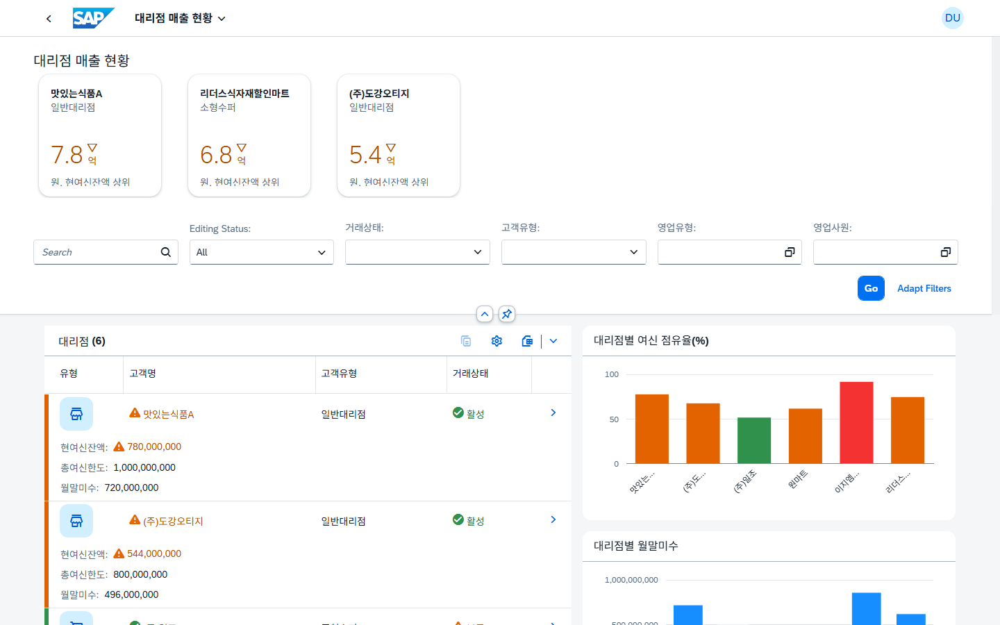

# 대리점 매출현황 — SAP Fiori Elements Custom Page (FPM) 데모

**mock 데이터** 기반의 조회 전용 SAP Fiori 데모 앱입니다. 대리점(거래처) 마스터와 월간 매출·여신 현황을
**Flexible Programming Model(FPM) Custom Page** 로 구성했습니다. 백엔드 없이 로컬 mock 서버로 바로 실행됩니다.

> 이 앱을 **에이전트 AI(Skill·MCP)** 로 만든 과정을 정리한 사례 문서 →
> **https://would-you-sap.github.io/sap-ai-case-study/**



## 무엇을 보여주나

- **Overview** — 대리점 리스트 + KPI 타일 + 여신 점유율/월말미수 차트, 신호등(R/Y/G) 상태 표시
- **Object Page** — 대리점별 월간 매출 상세, 값 도움말(Value Help), 인라인 생성·자동계산
- **FilterBar** — 거래상태·고객유형·영업유형·영업사원 필터

## 실행

```bash
npm install
npm run start-mock
```

브라우저가 열리며 FLP Sandbox에서 앱이 뜹니다. (별도 백엔드 불필요 — `@sap-ux/ui5-middleware-fe-mockserver` 가
`webapp/localService` 의 metadata + JSON mock 데이터를 서빙)

## 스택

| 항목 | 값 |
|---|---|
| 프레임워크 | SAPUI5 **1.149** · JavaScript |
| 페이지 | Fiori Elements **Custom Page (FPM)** |
| 빌딩블록 | `macros:FilterBar` · `macros:Table` · micro chart · 커스텀 VizFrame |
| 데이터 | OData V4 (로컬 fe-mockserver) |
| 네임스페이스 | `would.you.agency` |

## 구조

```
webapp/
├─ manifest.json            # 앱 설정·라우팅·데이터소스
├─ ext/                     # 커스텀 컨트롤러·프래그먼트(차트·KPI 등)
├─ annotations/             # UI 어노테이션
├─ i18n/                    # 다국어 문자열
└─ localService/mainService # mock metadata.xml + data/*.json
```

## 참고

조회 전용 데모입니다. 데이터는 전부 합성 mock 값이며 실제 업무 데이터와 무관합니다.

---
made by **would-you-sap** · https://would-you-sap.github.io/
